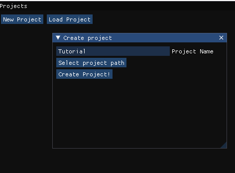
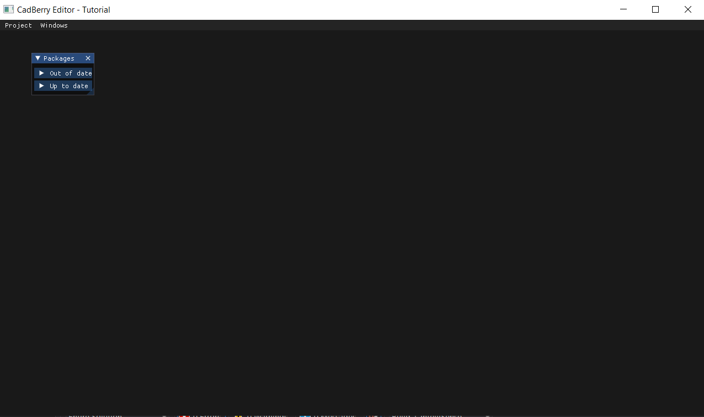
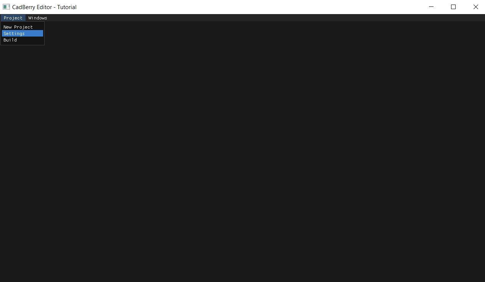

Getting Started
###############
Hey! 👋

Here's a basic guide to getting your CadBerry installation working. First things first, you need to download CadBerry. You could compile it manually, but 
we're going to use the installer script. Go to `this link <https://github.com/CamelCaseCam/CadBerry/releases/tag/Installer>` and download the 
Installer - beta.zip file. 

Once you've unpacked this file, run the Installer.bat file, which will download all of CadBerry's core components. If you run Berry.exe, you should get a 
screen like this

This is the project creation window. Before you can open the main editor, you need to create a project. Click "New project", enter the project's name, 
and click the "Select project path" button. Once you've done this, click the "Create project!" button to open CadBerry with that project. 

Once you've created the project, your screen should look like this. 

Before we go any further, we need to download the full CadBerry data. The installer just installs the basic GUI, so we need to update the CadBerry package. 
Expand the packages window, and under the "Out of date" option, click the "Update" button. Keep in mind, this will close the app in order to update it. 

Once the update is finished, try running the app. If it gives you an error and doesn't open, check the installer window. If it shows a bunch of files that
are 193kb or 194kb, those files failed to be downloaded and you should create an issue on the GitHub. You can re-run the installer to get the basic 
installation, but you'll probably have to wait until I fix it. 

There's just one more thing you might need to do to get this running. If you don't have it already, download `VSCode <https://code.visualstudio.com/download>`.
CadBerry uses VSCode as its default editor. While you can use notepad or any other code/text editor, you won't get precompilation and certain quality of 
life features. CadBerry's autogenerated entry points rely on precompilation, so if you don't have VSCode, you'll have to write your own entry points. 

Project configuration and source files
======================================
Okay, now you've got a working CadBerry installation. Before we can get started, we need to configure our project. Open CadBerry's settings window.

First, make sure that "Create entry point" is checked. We need to tell CadBerry which organism we want to target, so it can load the organism's data from 
a GILEncoding file. Right now that's only codon usage, but in the next release there will be more information included. CadBerry's supported targets are:

* 